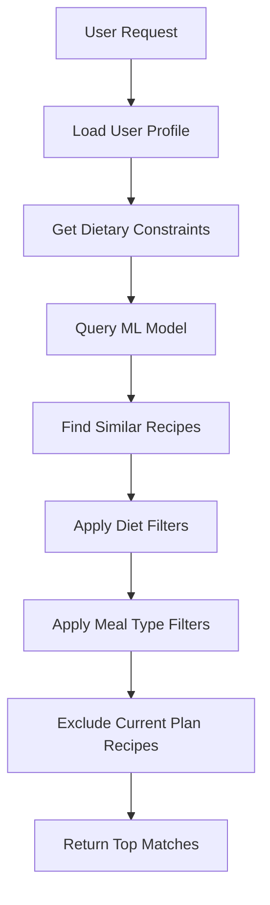

<Warning>
  This specific endpoint is not directly implemented. Recipe recommendations are provided through the chat interface and the swap meal endpoint.
</Warning>

## How Recommendations Work

SmartEat AI uses a machine learning model to provide personalized recipe recommendations. The system uses:

- **K-Nearest Neighbors (KNN)** algorithm for similarity matching
- **Nutritional profile matching** based on calories, protein, carbs, and fat
- **Diet type filtering** (vegan, vegetarian, high-protein, low-carb, etc.)
- **Meal type compatibility** (breakfast, lunch, dinner, snack)
- **User preference learning** from your profile tastes and restrictions

## Recommendation Features

### 1. Smart Meal Plan Generation

When you request a meal plan through the chat interface, the AI:

1. Analyzes your profile (goals, macros, preferences)
2. Selects recipes that match your nutritional targets
3. Ensures variety across the week
4. Respects your dietary restrictions and preferences
5. Balances meal types according to your meals-per-day setting

### 2. Recipe Similarity Matching

The ML model finds similar recipes based on:

<ParamField body="Nutritional similarity" type="calculation">
  Calculates distance in a scaled feature space of calories, protein, carbohydrates, and fat content
</ParamField>

<ParamField body="Diet compatibility" type="filter">
  Ensures recommended recipes match your selected diet types (e.g., vegan, high-protein)
</ParamField>

<ParamField body="Meal type matching" type="constraint">
  Only recommends recipes suitable for the target meal slot (breakfast, lunch, dinner, snack)
</ParamField>

<ParamField body="Exclusion logic" type="filter">
  Prevents recommending recipes already in your current meal plan
</ParamField>

## Getting Recommendations

You can get personalized recommendations through:

### Via Chat Interface

```bash Request via Chat
curl -X POST https://api.smarteat.ai/api/chat/ \
  -H "Authorization: Bearer <token>" \
  -d 'message=Suggest a high-protein breakfast for tomorrow'
```

### Via Swap Endpoint

For direct recipe swapping, use the [Swap Meal Recommendation](/api/recommendations/swap-meal) endpoint.

## ML Model Architecture

### Feature Space

The recommendation engine operates in a scaled feature space:

```python Feature Scaling
features = [
    'calories',      # Total caloric content
    'protein',       # Protein in grams
    'carbs',         # Carbohydrates in grams  
    'fat'           # Fat in grams
]

# Features are normalized using StandardScaler
# This ensures equal weight across different scales
```

### Similarity Calculation

```python K-Nearest Neighbors
# Model configuration
n_neighbors = 550  # Search space size (configurable)
metric = 'euclidean'  # Distance calculation method

# The model finds the closest recipes in the scaled feature space
# then filters by diet and meal type constraints
```

## Example Recommendation Flow



## Response Schema (Conceptual)

If this endpoint were implemented, it would return:

<ResponseField name="recommendations" type="array">
  Array of recommended recipes
  
  <Expandable title="Recipe recommendation">
    <ResponseField name="id" type="integer">
      Database ID of the recipe
    </ResponseField>
    
    <ResponseField name="recipe_id" type="integer">
      External recipe ID from the dataset
    </ResponseField>
    
    <ResponseField name="name" type="string">
      Name of the recipe
    </ResponseField>
    
    <ResponseField name="calories" type="integer">
      Total calories per serving
    </ResponseField>
    
    <ResponseField name="protein" type="integer">
      Protein in grams
    </ResponseField>
    
    <ResponseField name="carbs" type="integer">
      Carbohydrates in grams
    </ResponseField>
    
    <ResponseField name="fat" type="integer">
      Fat in grams
    </ResponseField>
    
    <ResponseField name="similarity_score" type="number">
      Distance metric indicating how similar this recipe is to your preferences (lower is more similar)
    </ResponseField>
    
    <ResponseField name="meal_types" type="array">
      Array of compatible meal types (breakfast, lunch, dinner, snack)
    </ResponseField>
    
    <ResponseField name="diet_types" type="array">
      Array of diet categories this recipe belongs to
    </ResponseField>
    
    <ResponseField name="image_url" type="string" nullable>
      URL to recipe image
    </ResponseField>
    
    <ResponseField name="recipe_url" type="string" nullable>
      URL to full recipe details
    </ResponseField>
  </Expandable>
</ResponseField>

## Notes

- The ML model is loaded on application startup for fast inference
- Recommendations are personalized based on your complete profile
- The system learns from your preferences over time
- Use the [Swap Meal](/api/recommendations/swap-meal) endpoint for direct recipe substitutions
