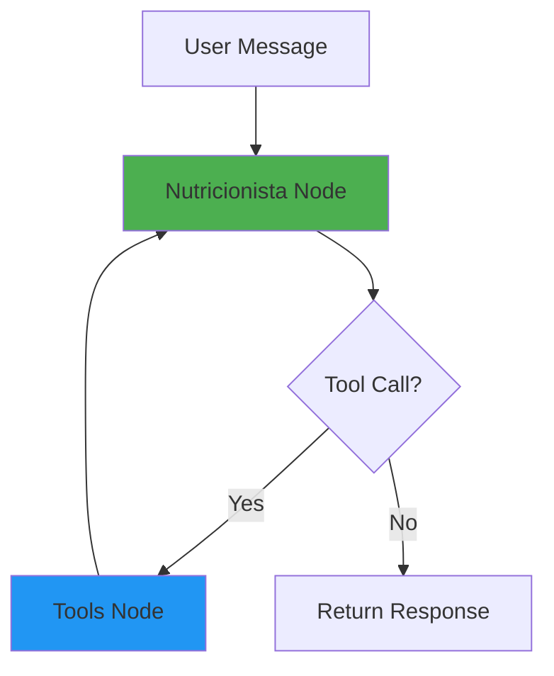

## Overview

**Smarty** is SmartEat AI's intelligent nutritional assistant, powered by LangChain and LangGraph. Smarty helps users manage their meal plans, swap recipes, and get personalized dietary advice through natural conversation.

<Info>
Smarty uses **Ollama** with the Llama 3.1 model for local, private AI inference without external API dependencies.
</Info>

## Architecture

The agent is built with LangGraph, a framework for stateful, multi-step AI workflows.



### Core Components

<Tabs>
  <Tab title="Workflow">
    **File**: `backend/app/services/agent/workflow.py`
    
    Defines the agent's state graph:
    
    ```python
    from langgraph.graph import StateGraph, END
    from langgraph.checkpoint.memory import MemorySaver
    from langgraph.prebuilt import ToolNode
    
    def build_graph():
        tool_node = ToolNode(nutrition_tools)
        workflow = StateGraph(DietGraphState)
        
        # Nodes
        workflow.add_node("nutricionista", agent.build_agent)
        workflow.add_node("tools", tool_node)
        
        # Edges
        workflow.set_entry_point("nutricionista")
        workflow.add_conditional_edges("nutricionista", should_continue, {
            "tools": "tools",
            END: END
        })
        workflow.add_edge("tools", "nutricionista")
        
        checkpointer = MemorySaver()
        return workflow.compile(checkpointer=checkpointer)
    ```
  </Tab>
  
  <Tab title="Executor">
    **File**: `backend/app/services/agent/executor.py`
    
    Manages the agent's inference:
    
    ```python
    class AgentManager:
        def __init__(self):
            self.llm = llm.bind_tools(nutrition_tools)
            self.tools = {tool.name: tool for tool in nutrition_tools}
        
        def build_agent(self, state: DietGraphState):
            # Optimize state for limited GPU memory
            optimized_state = optimize_state_for_inference(state)
            profile = optimized_state["profile"]
            messages = optimized_state["messages"]
            
            # Trim messages to fit context window
            trimmed_messages = trim_messages(
                messages,
                max_tokens=MAX_TOKENS_FOR_HISTORY,
                strategy="last",
                start_on="human",
                end_on=("human", "tool"),
            )
            
            system_prompt = get_nutritionist_prompt(profile)
            response = self.llm.invoke(
                [{"role": "system", "content": system_prompt}] 
                + trimmed_messages
            )
            
            return {"messages": [response]}
    ```
  </Tab>
  
  <Tab title="Memory">
    **File**: `backend/app/services/agent/memory.py`
    
    Optimized conversation memory management:
    
    ```python
    # Configuration for 8GB VRAM
    MAX_CONTEXT_TOKENS = 10000
    TOOL_RESULT_MAX_LENGTH = 10000
    
    class ConversationMemory:
        @staticmethod
        def compress_tool_results(messages: List[BaseMessage]):
            # Truncate long tool results
            for msg in messages:
                if hasattr(msg, 'type') and msg.type == 'tool':
                    if len(content) > TOOL_RESULT_MAX_LENGTH:
                        truncated = content[:TOOL_RESULT_MAX_LENGTH - 100] 
                                    + "\n\n[...truncated...]\n\n" 
                                    + content[-100:]
        
        @staticmethod
        def extract_essential_context(messages, max_tokens):
            # Keep last 6 messages (3 conversation turns)
            essential = messages[-6:]
            # Add older messages if space allows
            return essential
    ```
  </Tab>
  
  <Tab title="Prompts">
    **File**: `backend/app/services/agent/prompts.py`
    
    System prompt with user context:
    
    ```python
    def get_nutritionist_prompt(profile: ProfileResponse) -> str:
        return f"""
        You are Smarty, an expert Nutritionist Assistant.
        You only answer in English.
        
        ## FUNDAMENTAL RULES
        1. ALWAYS use a tool to respond (except greetings)
        2. NEVER ask the user for IDs
        3. Carefully read each tool's description
        
        ## USER CONTEXT
        - Daily meals: {profile.meals_per_day}
        - Distribution: {meal_context}
        
        ## BEHAVIOR
        - Be concise but clear
        - Number alternatives clearly (1, 2, 3)
        - Remember context when suggesting swaps
        """
    ```
  </Tab>
</Tabs>

## Agent Tools

Smarty has access to 7 specialized tools for meal planning:

<CardGroup cols={2}>
  <Card title="search_recipes_by_criteria" icon="magnifying-glass">
    Search recipes by name, ingredients, or nutritional requirements
  </Card>
  <Card title="generate_weekly_plan" icon="calendar-week">
    Create a complete 7-day meal plan based on user profile
  </Card>
  <Card title="get_current_plan_summary" icon="list-check">
    Display the user's active meal plan with all meals
  </Card>
  <Card title="suggest_recipe_alternatives" icon="arrows-rotate">
    Find 3 similar recipes for a specific meal
  </Card>
  <Card title="replace_meal_in_plan" icon="repeat">
    Swap a meal with a chosen alternative
  </Card>
  <Card title="update_user_preference" icon="user-pen">
    Update dietary preferences or restrictions
  </Card>
  <Card title="get_user_profile_summary" icon="id-card">
    View user's dietary profile and goals
  </Card>
</CardGroup>

### Tool Workflow Example

When a user says: **"Change my Wednesday lunch to something lighter"**

<Steps>
  <Step title="Agent Understands Intent">
    Smarty parses the request and identifies:
    - Action: Replace meal
    - Day: Wednesday (day 3)
    - Meal: Lunch
    - Criteria: Lower calories
  </Step>

  <Step title="Call suggest_recipe_alternatives">
    ```python
    suggest_recipe_alternatives(
        user_id=123,
        day_of_week=3,
        meal_type="lunch"
    )
    ```
    
    Returns 3 nutritionally similar but lower-calorie options.
  </Step>

  <Step title="Present Options">
    Smarty shows:
    ```
    Here are 3 lighter lunch alternatives for Wednesday:
    
    1. Grilled Chicken Salad (320 cal)
    2. Quinoa Buddha Bowl (350 cal)
    3. Turkey Wrap (280 cal)
    
    Which would you like?
    ```
  </Step>

  <Step title="User Chooses">
    User replies: **"Option 2"**
  </Step>

  <Step title="Call replace_meal_in_plan">
    ```python
    replace_meal_in_plan(
        user_id=123,
        day_of_week=3,
        meal_type="lunch",
        new_recipe_name="Quinoa Buddha Bowl"
    )
    ```
    
    Updates the database and confirms the change.
  </Step>
</Steps>

## State Management

### DietGraphState Schema

```python
class DietGraphState(TypedDict):
    messages: Annotated[list[AnyMessage], add_messages]
    profile: ProfileResponse
```

- **`messages`**: Conversation history with automatic deduplication
- **`profile`**: User's dietary profile (calories, restrictions, preferences)

### Memory Optimization

For environments with limited GPU (8GB VRAM):

<Tabs>
  <Tab title="Context Limits">
    ```python
    # Ollama configuration
    OLLAMA_CONTEXT_LENGTH = 32768  # docker-compose
    num_ctx = 16384                 # config_ollama
    MAX_CONTEXT_TOKENS = 10000      # memory.py
    ```
  </Tab>
  
  <Tab title="Compression">
    - Tool results are truncated if > 10,000 chars
    - Only last 6 messages are guaranteed to be kept
    - Older messages are added if tokens allow
  </Tab>
  
  <Tab title="Monitoring">
    ```python
    stats = get_state_stats({"messages": messages})
    logger.debug(f"📊 {stats['total_messages']} msgs, "
                 f"{stats['total_tokens']} tokens")
    ```
  </Tab>
</Tabs>

<Warning>
**GPU Memory Management**: The agent is optimized for 8GB VRAM. Exceeding context limits will cause OOM errors. Monitor token usage in production.
</Warning>

## Conversation Flow

### First Interaction

```text
User: Hi!
Smarty: Hello! I'm Smarty, your nutritional assistant. I can help you:
- Generate personalized meal plans
- Swap meals in your plan
- Search for recipes
- Update your dietary preferences

What would you like to do today?
```

### Meal Swap Flow

```text
User: I don't like the breakfast for tomorrow
Smarty: [calls get_current_plan_summary]
       [calls suggest_recipe_alternatives]
       
       Your current breakfast for Thursday is "Oatmeal with Berries".
       Here are 3 alternatives:
       
       1. Greek Yogurt Parfait (250 cal)
       2. Avocado Toast (320 cal)
       3. Smoothie Bowl (280 cal)
       
       Which one would you prefer?

User: Number 3
Smarty: [calls replace_meal_in_plan]
       
       ✅ Done! I've updated your Thursday breakfast to 
       "Smoothie Bowl". Enjoy!
```

## LangChain Integration

<CodeGroup>
```python Ollama Setup
from langchain_ollama import ChatOllama, OllamaEmbeddings

OLLAMA_CONFIG = {
    "model": "llama3.1",
    "base_url": "http://ollama:11434",
    "temperature": 0,
    "num_ctx": 16384,
    "num_predict": 4096,
}

llm = ChatOllama(**OLLAMA_CONFIG)
```

```python Tool Binding
from langchain.tools import tool

@tool
def generate_weekly_plan(user_id: int):
    """
    Generates a complete weekly nutritional plan (7 days).
    
    WHEN TO USE:
    - "Generate a plan"
    - "I need a new plan"
    - "Create weekly plan"
    """
    # Implementation...
    pass

llm_with_tools = llm.bind_tools(nutrition_tools)
```

```python Checkpoint Persistence
from langgraph.checkpoint.memory import MemorySaver

checkpointer = MemorySaver()
app_graph = workflow.compile(checkpointer=checkpointer)

# Invoke with thread_id for persistence
response = app_graph.invoke(
    {"messages": [user_message], "profile": profile},
    config={"configurable": {"thread_id": f"user_{user_id}"}}
)
```
</CodeGroup>

## API Integration

The agent is exposed via REST API:

```python
@router.post("/chat")
async def chat(
    request: ChatRequest,
    current_user: User = Depends(get_current_user),
    db: Session = Depends(get_db)
):
    profile = ProfileService.get_user_profile(db, current_user.id)
    
    response = app_graph.invoke(
        {
            "messages": [{"role": "user", "content": request.message}],
            "profile": profile
        },
        config={"configurable": {"thread_id": f"user_{current_user.id}"}}
    )
    
    return {"response": response["messages"][-1].content}
```

## Performance Optimization

<CardGroup cols={2}>
  <Card title="Lazy Loading" icon="bolt">
    Model and tools are loaded once at startup
  </Card>
  <Card title="Message Trimming" icon="scissors">
    Automatic context window management
  </Card>
  <Card title="Tool Result Caching" icon="database">
    Database queries are cached per session
  </Card>
  <Card title="Async Processing" icon="arrows-spin">
    Non-blocking API calls with FastAPI
  </Card>
</CardGroup>

## Debugging and Monitoring

```python
import logging

logger = logging.getLogger(__name__)
logger.setLevel(logging.INFO)

# Logs appear in console:
# 🤖 Agent initialized with 7 tools
# 📊 Estado: 8 msgs, 3421 tokens, tools: ['get_current_plan_summary']
# ✅ Optimized: 8 -> 6 messages, 3421 -> 2100 tokens
```

<Tip>
Set `logging.DEBUG` to see token counts and optimization steps in real-time.
</Tip>

## Future Enhancements

<Steps>
  <Step title="Persistent Memory">
    Replace MemorySaver with PostgreSQL or Redis for conversation persistence across sessions
  </Step>
  
  <Step title="Multi-Language Support">
    Currently English-only; add i18n for Spanish, French, etc.
  </Step>
  
  <Step title="Voice Interface">
    Integrate with speech-to-text for voice-based meal planning
  </Step>
  
  <Step title="Proactive Suggestions">
    Agent initiates conversations: "It's Sunday, want to generate next week's plan?"
  </Step>
</Steps>

<Card title="Related Documentation" icon="link">
  - [Ollama Setup](/development/ollama-setup) - Configuring the LLM backend
  - [KNN Recommender](/development/knn-recommender) - How recipe suggestions work
</Card>