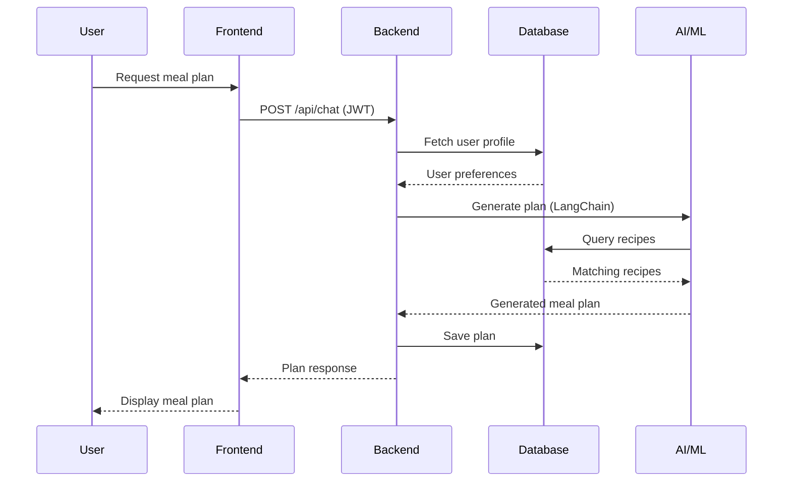

## Overview

SmartEat AI is a full-stack nutrition planning platform that combines artificial intelligence, machine learning, and modern web technologies to deliver personalized meal recommendations and nutritional guidance. The system follows a microservices architecture with clear separation between frontend, backend, database, and AI services.

## Architecture Diagram

The system architecture consists of four main layers working together to deliver a seamless user experience:


## System Components

<CardGroup cols={2}>
  <Card title="Frontend Layer" icon="display" color="#60a5fa">
    Next.js application providing a modern, responsive user interface for user interaction and data visualization
  </Card>
  
  <Card title="Backend Layer" icon="server" color="#34d399">
    FastAPI REST API handling business logic, authentication, and data processing
  </Card>
  
  <Card title="Database Layer" icon="database" color="#f87171">
    PostgreSQL relational database storing user profiles, recipes, plans, and nutritional data
  </Card>
  
  <Card title="AI/ML Layer" icon="brain" color="#a78bfa">
    LangChain agents, Ollama LLMs, and scikit-learn models powering intelligent recommendations
  </Card>
</CardGroup>

## Component Details

### Frontend Application

The frontend is built with **Next.js** and **TypeScript**, providing a modern single-page application experience:

- **App Router Architecture**: Utilizes Next.js 16's App Router for efficient routing and layouts
- **Protected Routes**: Authentication-based route protection for secure access
- **Context Providers**: React Context API for global state management (auth, profile)
- **Responsive Design**: Tailwind CSS for mobile-first, accessible UI components
- **Real-time Chat**: WebSocket-ready chat interface for AI agent interaction

**Key Modules:**
- Dashboard: Daily meal tracking and nutritional metrics
- Profile: User biometrics, goals, and dietary preferences
- My Plan: Weekly meal plan visualization and management
- Chat: Conversational interface with Smarty AI agent

### Backend API

The backend is a **FastAPI** application following clean architecture principles:

- **RESTful API**: Well-structured endpoints following REST conventions
- **JWT Authentication**: Secure token-based authentication with bcrypt password hashing
- **Database ORM**: SQLAlchemy for type-safe database operations
- **Alembic Migrations**: Version-controlled database schema management
- **Modular Services**: Separated business logic, CRUD operations, and API routes

**Architecture Layers:**
```
backend/
├── api/routes/      # HTTP endpoints
├── services/        # Business logic
├── crud/            # Database operations
├── models/          # SQLAlchemy models
├── schemas/         # Pydantic schemas
└── core/            # Config, security, ML
```

### Database Schema

**PostgreSQL** serves as the primary data store with a normalized relational schema:

- **Users & Authentication**: User credentials, profiles, and sessions
- **Recipes**: Nutritional information, ingredients, instructions, and dietary classifications
- **Plans & Menus**: Weekly meal plans, daily menus, and meal assignments
- **Preferences**: User dietary restrictions, tastes, and goals

The database design supports complex queries for recipe recommendation based on multiple dietary constraints and nutritional targets.

### AI & Machine Learning Services

The AI layer combines multiple technologies for intelligent nutrition guidance:

<Tabs>
  <Tab title="Conversational AI">
    **LangChain + LangGraph Agent**
    
    Smarty, the conversational agent, uses LangGraph to orchestrate complex workflows:
    - Multi-step reasoning for meal plan generation
    - Context-aware conversation handling
    - Dynamic plan modifications based on user requests
    - RAG (Retrieval-Augmented Generation) for recipe knowledge
    
    The agent integrates with Ollama (Llama 3/3.1) for local LLM inference.
  </Tab>
  
  <Tab title="Recommendation Engine">
    **K-Nearest Neighbors (KNN) Model**
    
    A trained scikit-learn KNN model powers real-time recipe recommendations:
    - Trained on 91,056+ cleaned recipes from Food.com
    - Features: macronutrients, ingredients, dietary labels, meal types
    - StandardScaler normalization for balanced feature weights
    - Joblib serialization for fast model loading
    
    The model suggests similar recipes when users request meal swaps.
  </Tab>
  
  <Tab title="Embeddings & Search">
    **ChromaDB Vector Database**
    
    Semantic search capabilities using Ollama embeddings:
    - Nomic-embed-text model for recipe embeddings
    - Vector similarity search for ingredient-based queries
    - Supports natural language recipe discovery
    
    *Note: Currently under development; direct PostgreSQL queries are used in production.*
  </Tab>
  
  <Tab title="Data Pipeline">
    **Preprocessing & Feature Engineering**
    
    Extensive data science pipeline for model training:
    - Data cleaning: removal of nulls, duplicates, and outliers
    - Nutritional analysis: macro distribution, ingredient frequency
    - Diet classification: vegan, vegetarian, keto, etc.
    - NLP processing: tokenization, lemmatization, keyword extraction
  </Tab>
</Tabs>

## Communication Flow

### User Request Flow



### Data Persistence

All user data, recipes, and generated plans are persisted in PostgreSQL:
- **User profiles** store biometric data and dietary preferences
- **Plans** link users to weekly meal assignments
- **Meal details** connect plans to specific recipes for each meal type

### AI Integration

The backend integrates AI services through well-defined interfaces:
- **Ollama Service**: Local LLM inference via HTTP API (port 11434)
- **ML Model Service**: In-memory KNN model for fast recommendations
- **LangChain Agents**: Stateful conversation management with tool calling

## Deployment Architecture

### Docker Containerization

The application is fully containerized using Docker Compose:

<CardGroup cols={2}>
  <Card title="Backend Container" icon="python">
    **smarteatai_backend**
    - Python 3.10+ with FastAPI
    - Port 8000 exposed
    - Volume-mounted for development
  </Card>
  
  <Card title="Frontend Container" icon="react">
    **smarteatai_frontend**
    - Node 20+ with Next.js
    - Port 3000 exposed
    - Hot-reload enabled
  </Card>
  
  <Card title="Database Container" icon="database">
    **smarteatai_db**
    - PostgreSQL 15
    - Port 5432 exposed
    - Persistent volume for data
  </Card>
  
  <Card title="Ollama Container" icon="microchip">
    **smarteatai_ollama**
    - Ollama LLM runtime
    - Port 11434 exposed
    - GPU acceleration support
  </Card>
</CardGroup>

### Service Dependencies

Services are orchestrated with proper dependency management:
- Frontend depends on Backend API availability
- Backend depends on Database and Ollama services
- Adminer (port 8080) provides database management UI

### Scalability Considerations

The architecture supports horizontal scaling:
- **Stateless API**: Backend can run multiple instances behind a load balancer
- **Database Connection Pooling**: SQLAlchemy manages connection efficiency
- **Model Caching**: ML models loaded once in memory per instance
- **Async Processing**: FastAPI's async support for concurrent requests

## Security Architecture

<Warning>
Security is built into every layer of the application.
</Warning>

### Authentication & Authorization

- **JWT Tokens**: Stateless authentication with signed tokens
- **Password Hashing**: Bcrypt with secure salt rounds
- **Protected Routes**: Frontend guards and backend middleware
- **Token Expiration**: Configurable session timeouts

### Data Protection

- **SQL Injection Prevention**: SQLAlchemy ORM with parameterized queries
- **Input Validation**: Pydantic schemas for request/response validation
- **Environment Variables**: Sensitive configs stored in `.env` files
- **CORS Configuration**: Controlled cross-origin access

## Performance Optimizations

### Frontend

- **Static Site Generation**: Pre-rendered pages where applicable
- **Code Splitting**: Automatic route-based chunking
- **Image Optimization**: Next.js Image component with lazy loading
- **Client-side Caching**: Context API reduces unnecessary API calls

### Backend

- **Connection Pooling**: Reusable database connections
- **Async Endpoints**: Non-blocking I/O for concurrent requests
- **Model Preloading**: ML models loaded at startup
- **Query Optimization**: Indexed database columns for fast lookups

### AI Services

- **Local Inference**: Ollama eliminates API latency
- **GPU Acceleration**: NVIDIA support for faster LLM responses
- **Context Window Management**: Optimized prompt sizes for Llama 3.1
- **Model Quantization**: Efficient model sizes for 8GB VRAM

## Monitoring & Observability

<Info>
The system includes built-in health checks and logging for operational visibility.
</Info>

- **Health Endpoints**: `/health` endpoints for service status
- **API Documentation**: Auto-generated Swagger UI at `/docs`
- **Database Admin**: Adminer interface for data inspection
- **Application Logs**: Structured logging in backend services

## Technology Stack Summary

The architecture leverages modern, production-ready technologies:

| Layer | Technologies |
|-------|-------------|
| **Frontend** | Next.js 16, TypeScript, React 19, Tailwind CSS |
| **Backend** | FastAPI, Python 3.10+, SQLAlchemy, Pydantic |
| **Database** | PostgreSQL 15, Alembic migrations |
| **AI/ML** | LangChain, LangGraph, Ollama (Llama 3.1), scikit-learn |
| **DevOps** | Docker, Docker Compose |
| **Authentication** | JWT, bcrypt |

---

<Card title="Next Steps" icon="arrow-right" href="/development/tech-stack">
  Dive deeper into the specific technologies used in each layer
</Card>
