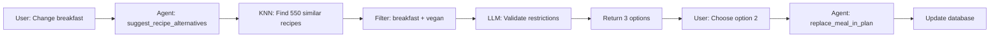

## Overview

The KNN (K-Nearest Neighbors) recommendation system is the core of SmartEat AI's recipe matching engine. It finds nutritionally similar recipes based on calorie and macronutrient profiles, enabling personalized meal plans and smart recipe swaps.

## How It Works

The KNN model operates in the **feature space** of nutritional values, using Euclidean distance to measure recipe similarity.

<Steps>
  <Step title="Feature Vector">
    Each recipe is represented as a 4-dimensional vector:
    
    ```python
    FEATURES = [
        'calories',          # Total calories per serving
        'fat_content',       # Grams of fat
        'carbohydrate_content', # Grams of carbs
        'protein_content'    # Grams of protein
    ]
    ```
  </Step>

  <Step title="Normalization">
    Features are standardized using scikit-learn's StandardScaler:
    
    ```python
    scaler = StandardScaler()
    X_scaled = scaler.fit_transform(df[FEATURES])
    ```
    
    This ensures all features contribute equally to distance calculations.
  </Step>

  <Step title="Similarity Search">
    The KNN model finds the N nearest neighbors in feature space:
    
    ```python
    knn = NearestNeighbors(n_neighbors=550, metric='euclidean')
    knn.fit(X_scaled)
    
    distances, indices = knn.kneighbors(recipe_vector)
    ```
  </Step>
</Steps>

## Model Architecture

<CodeGroup>
```python Model Loading (ml_model.py)
import joblib

class MLModel:
    def __init__(self):
        self.df = None
        self.scaler = None
        self.knn = None
        self.X_scaled_all = None

    def load(self):
        self.df = joblib.load("app/files/df_recetas.joblib")
        self.scaler = joblib.load("app/files/scaler.joblib")
        self.knn = joblib.load("app/files/knn.joblib")
        
        FEATURES = ['calories', 'fat_content', 
                    'carbohydrate_content', 'protein_content']
        self.X_scaled_all = self.scaler.transform(self.df[FEATURES])

ml_model = MLModel()
```

```python Recipe Swap (recommender.py)
def swap_for_similar(
    db: Session,
    user: User,
    recipe_id: int,
    meal_label: str,
    n_search: int = 550,
):
    # Get user's dietary restrictions
    profile = user.profile
    required_diets = {d.name.lower() 
                      for d in profile.diet_types}
    
    # Find recipe in dataframe
    idx_list = ml_model.df.index[
        ml_model.df["recipe_id"] == recipe_id
    ].tolist()
    
    base_index = idx_list[0]
    recipe_vec = ml_model.X_scaled_all[base_index].reshape(1, -1)
    
    # Find nearest neighbors
    distances, indices = ml_model.knn.kneighbors(
        recipe_vec, n_neighbors=n_search
    )
    
    # Filter by meal type and diet
    valid_neighbors = []
    for idx in indices[0][1:]:
        candidate = ml_model.df.iloc[idx]
        # Apply filters...
        valid_neighbors.append(candidate)
    
    return random.choice(valid_neighbors)
```
</CodeGroup>

## Model Files

The KNN system consists of three joblib files stored in `backend/app/files/`:

<CardGroup cols={3}>
  <Card title="df_recetas.joblib" icon="table">
    Cleaned recipe dataframe with features and metadata
  </Card>
  <Card title="scaler.joblib" icon="scale-balanced">
    StandardScaler fitted on training data
  </Card>
  <Card title="knn.joblib" icon="network-wired">
    Trained NearestNeighbors model
  </Card>
</CardGroup>

## Recommendation Process

### Finding Similar Recipes

When a user wants to swap a meal, the system:

<Steps>
  <Step title="Extract Base Recipe">
    Get the nutritional profile of the current recipe:
    
    ```python
    recipe = db.query(Recipe).filter(Recipe.recipe_id == recipe_id).first()
    base_index = ml_model.df.index[
        ml_model.df["recipe_id"] == recipe_id
    ].tolist()[0]
    ```
  </Step>

  <Step title="Query KNN Model">
    Find N nearest neighbors (default 550):
    
    ```python
    recipe_vec = ml_model.X_scaled_all[base_index].reshape(1, -1)
    distances, indices = ml_model.knn.kneighbors(
        recipe_vec, n_neighbors=550
    )
    ```
  </Step>

  <Step title="Apply Filters">
    Filter candidates by:
    - Meal type (breakfast, lunch, dinner, snack)
    - Dietary restrictions (vegan, vegetarian, etc.)
    - Recipes not already in the current plan
    
    ```python
    recipe_meals = {m.name.lower() for m in neighbor.meal_types}
    recipe_diets = {d.name.lower() for d in neighbor.diet_types}
    
    if meal_label.lower() not in recipe_meals:
        continue
    
    if required_diets and not required_diets.intersection(recipe_diets):
        continue
    ```
  </Step>

  <Step title="Return Best Match">
    Select a valid alternative:
    
    ```python
    if len(valid_neighbors) == 1:
        return valid_neighbors[0]
    return random.choice(valid_neighbors)
    ```
  </Step>
</Steps>

## Performance Characteristics

<Tabs>
  <Tab title="Speed">
    - **Query time**: ~50-100ms for 550 neighbors
    - **Memory**: ~200MB for model files
    - **Scalability**: O(log n) with ball tree indexing
  </Tab>
  
  <Tab title="Accuracy">
    - **Nutritional similarity**: Euclidean distance < 10% deviation
    - **Diet compliance**: 100% (hard filter)
    - **Variety**: Prevents repeating recipes within 6 days
  </Tab>
  
  <Tab title="Trade-offs">
    - **Pros**: Fast, deterministic, explainable
    - **Cons**: Doesn't learn user preferences over time
    - **Future**: Could be enhanced with collaborative filtering
  </Tab>
</Tabs>

## Integration Points

### Backend Services

The KNN model is used by:

1. **Agent Tools** (`backend/app/services/agent/tools/`)
   - `suggest_recipe_alternatives`: Finds 3 similar recipes
   - `replace_meal_in_plan`: Swaps a meal with a similar one

2. **Recommender Service** (`backend/app/core/recommender.py`)
   - `swap_for_similar()`: Core similarity search function

3. **Plan Generation** (`generate_weekly_plan.py`)
   - Ensures nutritionally balanced weekly plans

<Note>
The KNN model focuses on **nutritional similarity** only. Additional filters for ingredients, cuisine, and dietary restrictions are applied separately using SQL queries and LLM validation.
</Note>

## Example: Recipe Swap

Here's how a user swaps a breakfast recipe:



## Model Parameters

| Parameter | Value | Rationale |
|-----------|-------|----------|
| `n_neighbors` | 550 | Large pool for filtering |
| `metric` | euclidean | Intuitive for nutritional space |
| `algorithm` | auto | Scikit-learn optimizes based on data |

<Warning>
**Important**: The model is loaded once at application startup. Changes to the model files require a server restart.
</Warning>

## Future Enhancements

<CardGroup cols={2}>
  <Card title="Collaborative Filtering" icon="users">
    Learn from user ratings and swaps to improve recommendations
  </Card>
  <Card title="Deep Learning" icon="brain">
    Use embeddings to capture ingredient relationships and flavor profiles
  </Card>
  <Card title="A/B Testing" icon="flask">
    Compare KNN vs. other algorithms for user satisfaction
  </Card>
  <Card title="Real-time Training" icon="arrows-rotate">
    Update model as new recipes are added to the database
  </Card>
</CardGroup>

<Card title="Related Documentation" icon="link">
  - [ML Pipeline](/development/ml-pipeline) - How the model is trained
  - [AI Agent](/development/ai-agent) - How recommendations are presented to users
</Card>